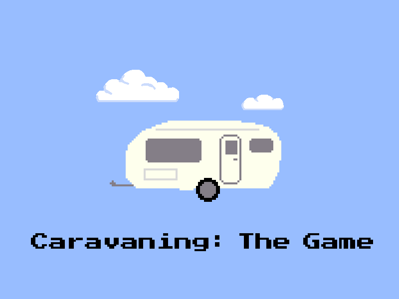

"Finally!" you cry, "a game that truly reflects my love of caravans."


## Developing

This game is built and run using npm and webpack. To install:

```sh
# Install the required dependencies
$ npm i

# Start the server in a new browser window on port 8080
$ npm run start
```

The game is now accessible at http://localhost:8080/game